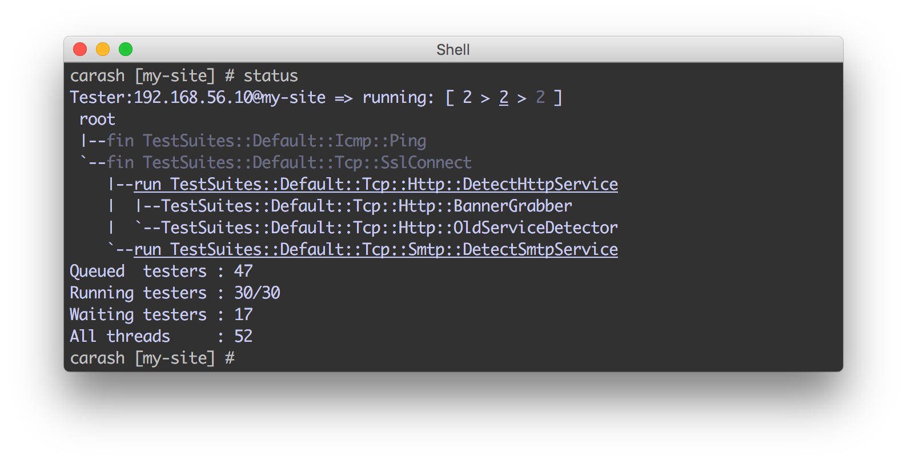
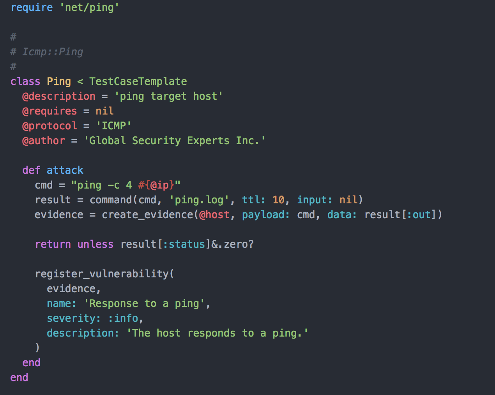
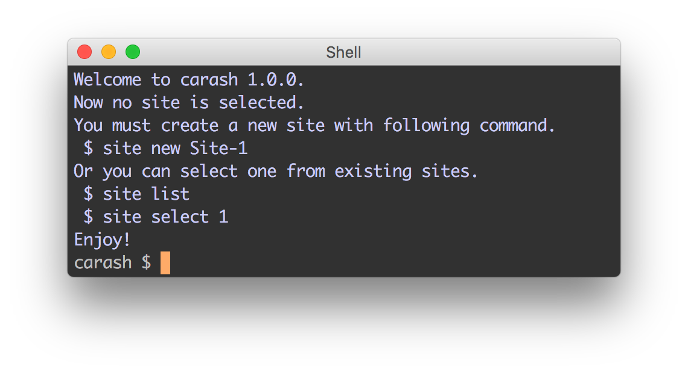

# Caras-Framework

Caras-Framework は脆弱性診断を自動化するための Framework です.

[English](README.md)

## 概要

### 脆弱性診断のためのジョブコントローラ

このフレームワークは脆弱性診断のための複数の *TestCase* をあらかじめ定義された順番で実行します. *TestCase* には, 木構造の依存関係を定義することができます.

Caras-Framework は *TestCase* の実行状況を監視し, 制御します.

### Rubyでプログラムできる脆弱性診断

*TestCase* は Ruby で[簡単](docs/DEVELOP_TEST_SUITES.ja.md#実装例)にプログラムすることができます.

### 拡張性

複数の *TestCase* をまとめて *TestSuite* を構築することができます. インストールした複数の *TestSuite* を切り替えながら診断を行うことが可能です. コマンドやレポートテンプレートを追加することもできます.

## 制限

### 網羅性なし

[Nexpose](https://www.rapid7.com/products/nexpose/) や, [OpenVas](http://www.openvas.org), [Nessus](https://www.tenable.com/products/nessus-vulnerability-scanner), [Retina](https://www.beyondtrust.com/products/retina-network-security-scanner/) などの有名なセキュリティスキャナとは異なり, Caras-Framework はあらかじめ定義された *TestSuite* を持ちません. 公開された *TestSuite* をインストールするか, 自分で開発する必要があります. 公式の *TestSuite* もありますが, あくまでサンプルです. 網羅的なテストを求めているならば, 他にもっと良いツールがたくさんあります.

### GUIなし

Caras-Framework には Web UIがありません. CUIのみです. Terminal の操作に慣れている人には使いやすいかもしれません. これは GUI がなければ操作できない人には向いていません.

## つまり

あなたの脆弱性診断生活を効率化するためのフレームワークです.

# インストール方法

すぐに試したい場合は Docker を使用すると良いでしょう. Caras-Framework をネイティブな Windows 環境で動かすことはできませんが, Docker を使えば Windows 上でも動かすことができます.

* [Docker](docs/INSTALL.ja.md#docker-にインストール)

*TestSuite* や機能拡張の開発を行う場合は, ネイティブ環境にインストールすることをお勧めします.

* [macOS](docs/INSTALL.ja.md#macos-にインストール)
* [Kali Linux](docs/INSTALL.ja.md#kali-linux-にインストール)

# チュートリアル

`carash` の起動に成功しましたか?

おめでとうございます. 脆弱性診断を始めましょう.

[チュートリアル](docs/TUTORIAL.ja.md)

# *TestSuite* の開発

*TestSuite* の開発方法を学びましょう.

[*TestSuite* の開発](docs/DEVELOP_TEST_SUITES.ja.md)

# License

Caras-Framework by Global Security Experts Inc. is licensed under the Apache License, Version2.0
